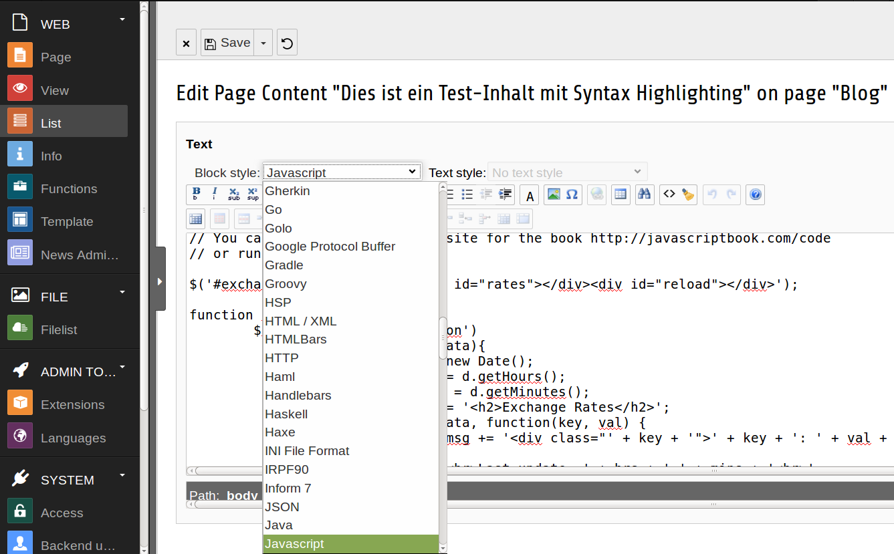
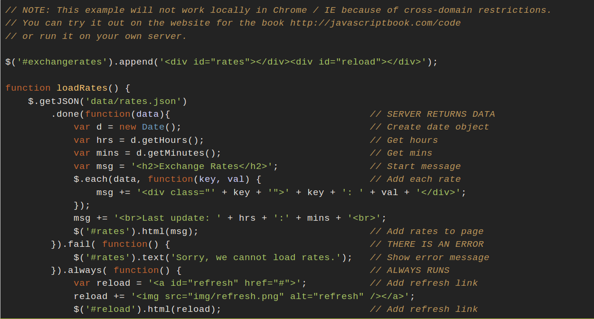

.. ==================================================
.. FOR YOUR INFORMATION
.. --------------------------------------------------
.. -*- coding: utf-8 -*- with BOM.

.. include:: ../Includes.txt

What does it do?
================

This is a Typo3-Extension that integrates the Javascript-based syntax highlighting
library `highlight.js <https://highlightjs.org/>`_ into Typo3's RTE. With this
extension, editors can easily add code snippets into any RTE content element or
content field, using up to 150 supported languages and multiple styles. 

Rendering is performed either in browser or, if desired, server-side by means of
the PHP extension  `v8js <http://php.net/manual/en/book.v8js.php>`_.

Screenshots
-----------

	**Selecting the code syntax of a preformatted text**

	**Resulting frontend rendering**

Dependencies
------------

- Typo3 v7.x
- PHP extension `v8js <http://php.net/manual/en/book.v8js.php>`_ (optional)

Credits
-------
Credits go to Ivan Sagalaev, the author of `highlight.js <https://highlightjs.org/>`_.
Without his great Javascript library, this extension would not exist.
